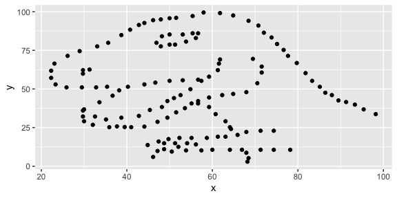

Lab 01 - Hello R
================
Alexander Connolly
1/20/2022

## Load packages and data

``` r
library(tidyverse) 
library(datasauRus)
```

## Exercises

### Exercise 1

``` r
datasaurus_dozen %>%
  count(dataset) %>%
  print(13)
```

    ## # A tibble:
    ## #   13 × 2
    ##    dataset   
    ##    <chr>     
    ##  1 away      
    ##  2 bullseye  
    ##  3 circle    
    ##  4 dino      
    ##  5 dots      
    ##  6 h_lines   
    ##  7 high_lines
    ##  8 slant_down
    ##  9 slant_up  
    ## 10 star      
    ## 11 v_lines   
    ## 12 wide_lines
    ## 13 x_shape   
    ## # … with 1
    ## #   more
    ## #   variable:
    ## #   n <int>

### Exercise 2

First let’s plot the data in the dino dataset:

``` r
dino_data <- datasaurus_dozen %>%
  filter(dataset == "dino")

ggplot(data = dino_data, mapping = aes(x = x, y = y)) +
  geom_point()
```

<!-- -->

``` r
dino_data %>%
  summarize(r = cor(x, y))
```

    ## # A tibble: 1 × 1
    ##         r
    ##     <dbl>
    ## 1 -0.0645

### Exercise 3

Add code and narrative as needed. Note that the R chunks are labeled
with `plot-star` and `cor-star` to provide spaces to place the code for
plotting and calculating the correlation coefficient. To finish, clean
up the narrative by removing these instructions.

``` r
star_data <- datasaurus_dozen %>%
filter(dataset == "star")
ggplot(data = star_data, mapping = aes(x=y, y=y)) +
geom_point()
```

<!-- -->

``` r
star_data %>%
summarize(r=cor(x,y))
```

    ## # A tibble: 1 × 1
    ##         r
    ##     <dbl>
    ## 1 -0.0630

R(star) = -.0629611 vs R(dino) = -.06447185

They are almost the same!

### Exercise 4

``` r
circle_data <- datasaurus_dozen %>%
  filter(dataset == "circle")

ggplot(data=circle_data, mapping =aes(x=y, y=y)) +geom_point()
```

<!-- -->

``` r
circle_data %>%
  summarize(r=cor(x,y))
```

    ## # A tibble: 1 × 1
    ##         r
    ##     <dbl>
    ## 1 -0.0683

r(circle) = -.06834336 vs r(dino) = -.06447185

They are almost the same!

### Exercise 5

``` r
ggplot(datasaurus_dozen, aes(x = x, y= y,color = dataset)) +
  geom_point()+
  facet_wrap(~ dataset, ncol=3) +
  theme(legend.position = "none")
```

<!-- -->

``` r
datasaurus_dozen %>%
  group_by (dataset) %>%
  summarize(r=cor(x,y)) %>%
  print(13)
```

    ## # A tibble:
    ## #   13 × 2
    ##    dataset   
    ##    <chr>     
    ##  1 away      
    ##  2 bullseye  
    ##  3 circle    
    ##  4 dino      
    ##  5 dots      
    ##  6 h_lines   
    ##  7 high_lines
    ##  8 slant_down
    ##  9 slant_up  
    ## 10 star      
    ## 11 v_lines   
    ## 12 wide_lines
    ## 13 x_shape   
    ## # … with 1
    ## #   more
    ## #   variable:
    ## #   r <dbl>
